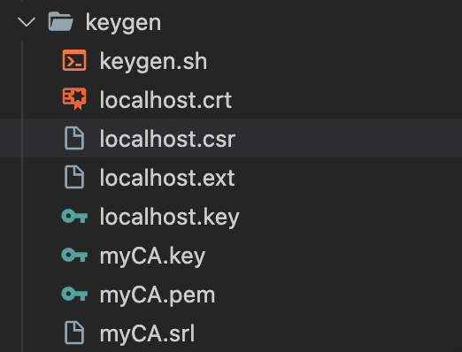
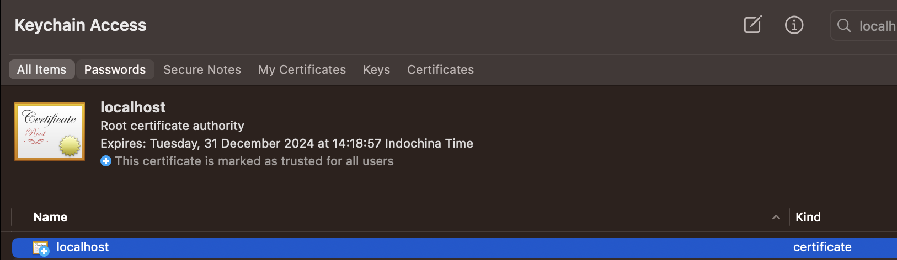
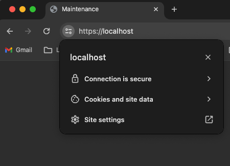

# Running Nginx with Docker and config Free SSL
This repository provides a Dockerfile to run Nginx inside a Docker container and step by step to config **Free SSL** in localhost domain. It is a simple setup that can be customized according to your project requirements.

## Prerequisites
Before you begin, make sure you have Docker installed on your machine. You can download Docker from here.

## Getting Started
### 1. Clone this repository to your local machine:
```bash
git clone https://github.com/anthoai97/simple-free-nginx-ssl
```

### 2. Navigate to the project directory:
```bash
cd simple-free-nginx-ssl
```

### 3. Build the Docker image:
```bash
docker build -t simple-free-nginx-ssl .
```

### 4. Run the Docker container:
```bash
docker run --rm -p 443:443 simple-free-nginx-ssl
```

This command maps port 443 on your local machine to port 443 inside the container. You can customize the port mappings as needed.
Open your browser and visit https://localhost to view the Nginx welcome page.

You also follow next step to config SSL for our final objective.

## Setup free SSL for Nginx
### 1. Setup Trust authority of the certificate

- Become a CA.
- Sign your certificate using your CA cert+key.
- **Import myCA.pem as an "Authority" (not into "Your Certificates") in your Chrome settings (Settings > Manage certificates > Authorities > Import).**
- **Use the $NAME.crt and $NAME.key files in your server.**

> Full desciption of each step can find at: https://stackoverflow.com/questions/7580508/getting-chrome-to-accept-self-signed-localhost-certificate

```bash
cd keygen
chmod +x keygen.sh
./keygen.sh
```

- This command will ask for the following info:
    - Country Name
    - State or Province Name
    - Locality Name
    - Organization Name
    - Organizational Unit Name
    - **Common Name** (make sure you set the "CommonName" to the same as $NAME when it asks for setup.)
    - Email Address

- After command these files will be generated:




- Use myCA.pem into Keychain (for MAC user) or Chrome settings (Settings > Manage certificates > Authorities > Import).




> Note: this will work only on chrome & safari, because those browsers check keychain access to get list of CAs. Firefox stores its own list of trusted CAs in the browser, so firefox will still throw the security error.


- Use localhost.crt & localhost.key for Nginx config like below

### 2. Update nginx.conf file
```
    listen                 443 ssl;
    ssl_certificate      /etc/ssl/localhost.crt;
    ssl_certificate_key  /etc/ssl/localhost.key;
    ssl_ciphers          HIGH:!aNULL:!MD5;
    server_name     localhost;
```

### 3. Rebuild and restart Docker with addition lines
```Dockerfile
COPY ./keygen/localhost.crt /etc/ssl/localhost.crt
COPY ./keygen/localhost.key /etc/ssl/localhost.key
```

### 4. Result


## Author

<table>
  <tr>
    <td align="center"><a href="https://github.com/anthoai97"><br /><sub><b>An Thoai</b></sub></a><br /></td>
    </tr>
</table>

## License

This project is licensed under the terms of the MIT license.